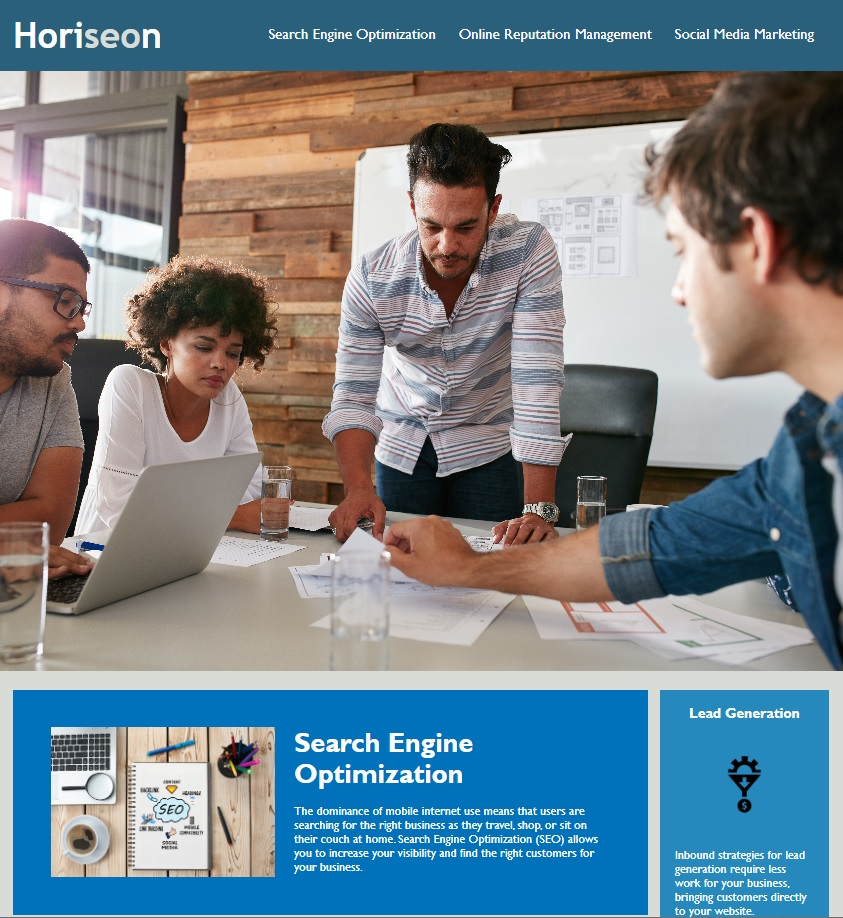

# Horiseon Marketing Agency

## Description

This project is a practice to refactor accessibility standards for Horiseon marketing agency to be optimized for search engines. In order to achieve this, I went through a developed HTML and viewed the structure related to CSS. Going through the CSS, I consolidated it to reduce redundancy and produce a cleaner code. This project allowed for me to learn about semantic structure and practice the art of cleaner code (as well as the DRY principle in CSS).

## Usage

    ```md
    
    ```

## Credits

This code was supplied by user Xandromus at https://github.com/coding-boot-camp/urban-octo-telegram to use for practice.
